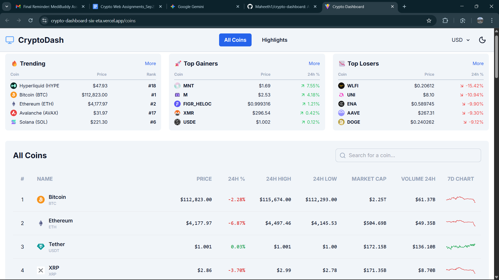
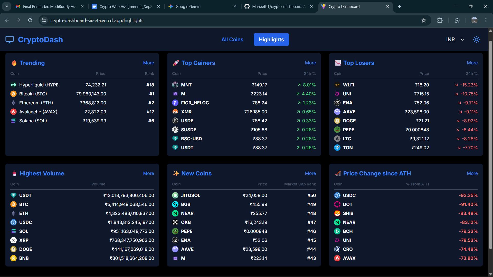

# CryptoDash: A Production-Like Cryptocurrency Dashboard

**CryptoDash** is a responsive, feature-rich web application that provides live cryptocurrency market data, built as a response to a take-home development assignment. It features a detailed "All Coins" overview with advanced data points and a comprehensive "Highlights" section. The project emphasizes clean code, modern design patterns, and a polished user experience with features like theme switching and client-side routing.

**Live Application Link:** **https://crypto-dashboard-six-eta.vercel.app/**

---

## Final Application Screenshots

#### All Coins View (with Light Mode)


#### Highlights View (with Dark Mode)


---

## 1. Setup and Installation Instructions

To get a local copy up and running, please follow these simple steps.

### Prerequisites

-   Node.js (v18 or later recommended)
-   npm (or yarn/pnpm)

### Installation & Setup

1.  **Clone the repository:**
    ```bash
    git clone https://github.com/Maheeth1/crypto-dashboard.git
    cd crypto-dashboard
    ```

2.  **Install NPM packages:**
    ```bash
    npm install
    ```

3.  **Set up Environment Variables (API Key):**
    This project requires a free API key from CoinGecko to fetch market data.
    -   Create an account and get your key from the [CoinGecko API Documentation](https://www.coingecko.com/en/api/documentation).
    -   In the root of the project, create a new file named `.env.local`.
    -   Copy the contents from the `.env.example` file into your new `.env.local` file.
    -   Replace the placeholder with your actual API key:
        ```env
        # .env.local
        VITE_COINGECKO_API_KEY=your_coingecko_api_key_here
        VITE_COINGECKO_API_URL=https://api.coingecko.com/api/v3
        ```
    > **Note:** The `.env.local` file is listed in `.gitignore` and will never be committed to the repository.

4.  **Run the Development Server:**
    ```bash
    npm run dev
    ```
    The application will now be running on `http://localhost:5173` (or the next available port).

---

## 2. Tech Stack and Architecture Overview

The architecture was designed for scalability, maintainability, and a clean separation of concerns.

-   **Framework**: **React 18** (via **Vite**) was chosen for its fast development environment and robust ecosystem.
-   **Language**: **TypeScript** is used throughout the project to ensure type safety, reduce runtime errors, and improve code quality and maintainability.
-   **Routing**: **React Router DOM** provides seamless client-side routing, enabling a multi-page feel within a Single-Page Application (SPA) and allowing for deep linking.
-   **Styling**: **Tailwind CSS** is used for its utility-first approach, enabling rapid development of a consistent, responsive, and easily themeable UI without writing custom CSS.
-   **Data Fetching & State Management**: **TanStack Query (React Query)** is the cornerstone of the data layer. It manages all server state, handling caching, background refetching, and error states declaratively, which significantly simplifies component logic.
-   **API Client**: **Axios** provides a simple and consistent interface for making HTTP requests to the CoinGecko API.

The project is structured into logical folders (`components`, `hooks`, `lib`, `context`, `views`) to keep the codebase organized and easy to navigate.

---

## 3. Features Implemented

This project successfully implements all core requirements and includes additional enhancements for a superior user experience.

-   **Two Main Views**: A tabbed interface to switch between the "All Coins" and "Highlights" views using **React Router**.
-   **Enhanced All Coins Table**:
    -   Displays Rank, Name, Price, Market Cap, and Volume.
    -   **Advanced Data**: Includes columns for **1h, 24h, 7d, and 30d** price changes.
    -   **7-Day Sparkline Graph**: A visual representation of the weekly price trend for each coin.
-   **Comprehensive Highlights Section**:
    -   Summary cards on the main page for a quick overview.
    -   A dedicated highlights page with detailed lists for:
        -   🔥 Trending Coins
        -   🚀 Top Gainers (24h)
        -   📉 Top Losers (24h)
        -   🥤 Highest Volume
        -   ✨ Newest Coins (by market cap rank)
        -   🎢 Biggest Drop from All-Time High
    -   **"More" Functionality**: Each highlight card links to a detailed, sorted view for that category.
-   **Light/Dark Mode Theming**: Full application theme switching with a toggle in the header, with user preference saved.
-   **Dynamic Currency Switching**: Instantly change the display currency for all monetary values.
-   **Robust UX States**: Clean loading skeletons, clear error messages with a retry option, and empty state handling.
-   **Responsive Design**: A seamless experience across desktop, tablet, and mobile devices.

---

## 4. Design Patterns Used and Rationale

Specific design patterns were intentionally used to solve common problems and ensure the codebase is robust and scalable.

1.  **Custom Hook Pattern**
    -   **Rationale**: To decouple business logic (especially data fetching) from the UI. Components shouldn't know *how* to fetch data, only that they *need* it.
    -   **Implementation**: All data-fetching logic is encapsulated within custom hooks (e.g., `useMarketData`). Components call these hooks and receive a simple, clean state (`data`, `isLoading`, `isError`). This makes components highly reusable and focused solely on presentation.

2.  **Adapter (or Mapper) Pattern**
    -   **Rationale**: To decouple the application's internal data model from the external API's data structure. This protects the application from changes in the API response.
    -   **Implementation**: In `src/lib/coingecko.ts`, the `fetchMarketData` function receives raw data from the API and immediately maps it to our internal `Coin` TypeScript interface. If CoinGecko changes a field name, we only need to update the mapping in this one location, and the rest of the application remains unaffected.

3.  **Provider Pattern**
    -   **Rationale**: To provide global state or functionality to the entire component tree without "prop drilling".
    -   **Implementation**: `QueryClientProvider` (from TanStack Query) and our custom `ThemeProvider` wrap the application in `main.tsx`. This gives every component access to the global server cache and the current theme state, respectively.

---

## 5. Assumptions, Limitations, and Future Improvements

### Assumptions
-   The user has a modern browser with JavaScript enabled.
-   The CoinGecko API is available and its rate limits are sufficient for the scope of this application.
-   For sorting and filtering highlights, fetching the top 100 coins provides a large enough dataset for meaningful results.

### Limitations
-   **Real-time Data**: The application currently fetches data on load and periodically in the background (managed by TanStack Query). It does not use WebSockets for real-time, push-based price updates.
-   **Server-Side Operations**: Search and sorting are performed client-side. For a massive dataset (e.g., thousands of coins), this would become inefficient and would need to be moved to a dedicated backend.

### Future Improvements
-   **Real-Time Updates**: Implement WebSockets to stream live price updates for a more dynamic user experience.
-   **Advanced Charting**: Integrate a dedicated charting library (like Chart.js or Recharts) on a detailed coin view page to show historical price data.
-   **User Accounts & Watchlist**: Allow users to create accounts and save a personalized watchlist of their favorite cryptocurrencies.
-   **Testing**: Implement a comprehensive testing suite with Vitest and React Testing Library to cover critical components and utility functions, ensuring long-term code stability.
